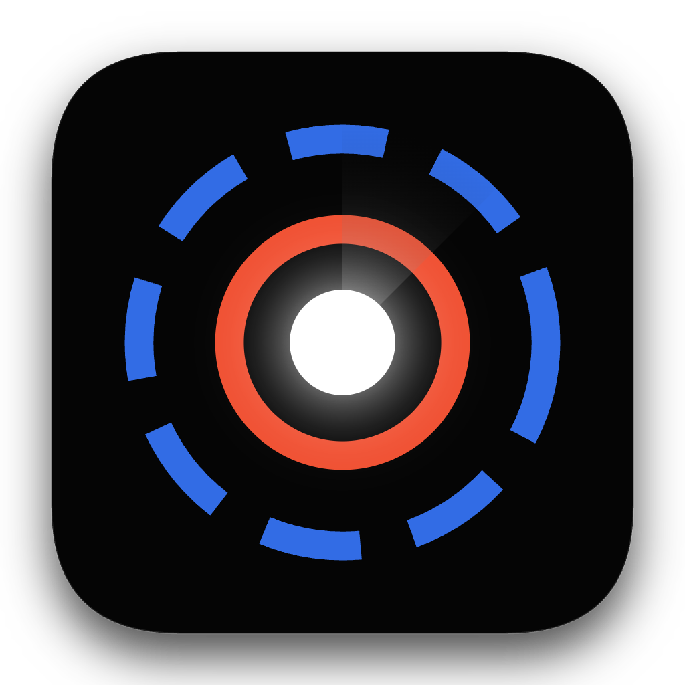

<p align="center">
  
</p>

<h1 align="center">Krust Operator</h1>

<p align="center"><strong>What if your Kubernetes operator could think?</strong></p>

A generic AI-driven K8s operator where reconciliation logic is not code — it's an AI agent. Define a **skill** (what to manage), create an **AIResource** (what you want), and the agent figures out the rest: deploys, scales, heals, patches — all by reasoning about desired vs actual state.

No giant `switch` statements. No 10,000-line controllers. Just markdown skills and natural language goals.

## Why Not Just Helm?

Different tools, different jobs.

**Helm** is a package manager — it renders templates, applies them, done. For Day 1 deployment, Helm (or Helm + ArgoCD/Flux for GitOps drift detection) is battle-tested and deterministic.

**Krust** explores a different idea: what if the **reconciliation logic itself** was written in natural language instead of code?

| | Helm / GitOps | Traditional Operator (Go/Rust) | Krust |
|---|------|---|---|
| **Deploy** | Templates + values | Hardcoded in controller | Agent reads skill, decides |
| **Drift healing** | ArgoCD re-syncs manifests | Coded reconcile loop | Agent re-applies from desired state |
| **Health response** | External alerting needed | Coded per-workload | Agent reasons from skill knowledge |
| **New workload** | New chart (~same effort) | Thousands of lines of code | New skill directory (markdown + templates) |
| **Behavior is...** | Deterministic | Deterministic | Non-deterministic (LLM) |

The real comparison is **Krust vs traditional operators** (like the Redis operator, PostgreSQL operator, etc.). Those require thousands of lines of Go/Rust per workload. Krust replaces that code with markdown skills that an LLM agent interprets at runtime.

### Trade-offs

Krust trades **determinism for flexibility**:

- **Pro**: Adding a new workload = 0 lines of Rust, just markdown + shell scripts
- **Pro**: Agent can reason about novel situations not explicitly coded
- **Pro**: Agent can use existing Helm charts — no need to rewrite deployment logic
- **Con**: Each reconciliation costs an LLM API call (~30s latency, ~$0.01)
- **Con**: Agent can make mistakes — loop detection and circuit breakers catch most, but not all
- **Con**: Helm/ArgoCD are production-proven; Krust is a proof of concept

**Use Helm** for straightforward deployments. **Use a traditional operator** when you need battle-tested, deterministic Day 2 operations. **Explore Krust** if you're interested in whether LLM agents can replace hand-written operator code.

## Architecture

```
                    ┌──────────────┐
                    │  AIResource  │  "Deploy a 3-master Valkey cluster, 512mb"
                    │  (goal+skill)│
                    └──────┬───────┘
                           │
              ┌────────────▼────────────┐
              │      Controller         │
              │  watches + detects:     │
              │  • bootstrap            │
              │  • spec change          │
              │  • drift (missing child)│
              │  adaptive requeue       │
              └────────────┬────────────┘
                           │ events
              ┌────────────▼────────────┐
              │   Single Agent Loop     │
              │                         │
              │  Observe → Decide →     │
              │  Act → Verify → Adapt   │
              │                         │
              │  • loop detection       │
              │  • tool deduplication   │
              │  • history compaction   │
              └────────────┬────────────┘
                           │ tools
              ┌────────────▼────────────┐
              │    Tool Layer           │
              │  helm_install/upgrade   │
              │  kubectl_exec/get/desc  │
              │  get_state/update_status│
              │  file_read/glob/grep    │
              └─────────────────────────┘
```

### Design Principles

- **Skill** = source of truth — markdown defines what the agent knows and can do
- **Agent** = decision maker — single autonomous agent reasons continuously about state and decides actions
- **K8s runtime** = delegated executor — the agent's tools, not the controller's logic

Adding a new workload (PostgreSQL, Kafka, etc.) requires **zero Rust code** — just a new skill directory with markdown and optional shell scripts.

## Quick Start

```bash
# Prerequisites: Rust 1.75+, Helm 3, a K8s cluster (kind, OrbStack, etc.)

# Install CRD and RBAC
kubectl apply -f manifests/crd.yaml
kubectl apply -f manifests/rbac.yaml

# Run operator locally
SKILLS_DIR=./skills RUST_LOG=info cargo run --bin krust-operator

# Deploy a Valkey cluster
kubectl apply -f manifests/samples/valkey-cluster-helm.yaml

# Watch the agent work
kubectl get airesource -w
```

## Examples

### Valkey Cluster (Helm-based)

```yaml
apiVersion: krust.io/v1
kind: AIResource
metadata:
  name: my-valkey
spec:
  skill: valkey-cluster-helm
  goal: "Deploy a 3-master Valkey cluster with 1 replica each, 512mb memory"
  agent:
    provider: vertex
    region: us-east5
    project_id: my-project
```

The agent will: check if a Helm release exists, run `helm install` with computed values (cluster.nodes=6, cluster.replicas=1, memory=512Mi), wait for all pods, verify `CLUSTER INFO` shows `cluster_state:ok` with 16384 slots, update status to Running.

### Scaling

```bash
# Scale up to 4 masters — agent runs helm upgrade + CLUSTER MEET
kubectl patch airesource my-valkey --type merge \
  -p '{"spec":{"goal":"Deploy a 4-master Valkey cluster with 1 replica each, 512mb memory"}}'

# Scale down to 3 masters — agent migrates slots, runs CLUSTER FORGET, then helm upgrade
kubectl patch airesource my-valkey --type merge \
  -p '{"spec":{"goal":"Deploy a 3-master Valkey cluster with 1 replica each, 256mb memory"}}'
```

### PostgreSQL

```yaml
apiVersion: krust.io/v1
kind: AIResource
metadata:
  name: my-postgres
spec:
  skill: postgresql
  goal: "Deploy a single PostgreSQL instance with 1Gi memory"
  image: postgres:16
  resources:
    limits:
      memory: "1Gi"
      cpu: "500m"
  agent:
    provider: vertex
    region: us-east5
```

### Self-Healing

```bash
# Delete a child resource — agent detects drift and re-applies
kubectl delete configmap my-postgres-config

# Change the goal — agent observes state change, adapts, and executes
kubectl patch airesource my-postgres --type merge \
  -p '{"spec":{"goal":"Deploy a single PostgreSQL instance with 2Gi memory"}}'

# Delete the AIResource — K8s garbage collects all child resources
kubectl delete airesource my-postgres
```

## Skills

Skills define **what** the operator can manage. Each skill is a self-contained directory:

```
skills/
├── valkey-cluster-helm/
│   ├── SKILL.md              # Helm chart knowledge + agent prompt config
│   ├── prompts/
│   │   └── agent.md          # Single agent system prompt
│   └── scripts/
│       └── monitors/
│           └── health_check.sh
│
└── postgresql/
    ├── SKILL.md
    ├── prompts/
    │   └── agent.md
    ├── scripts/
    │   └── monitors/
    └── templates/
        ├── configmap.yaml
        ├── service.yaml
        └── statefulset.yaml
```

### Skill Types

**Helm-based skills** (e.g., `valkey-cluster-helm`) — agent uses `helm install/upgrade` tools. The SKILL.md contains chart knowledge (values mapping, scaling procedures). No templates needed.

**Template-based skills** (e.g., `postgresql`) — agent uses `apply_template` to render and apply K8s manifests. Templates live in the skill directory.

### SKILL.md Format

```yaml
---
name: valkey-cluster-helm
description: Manage Valkey cluster using Bitnami Helm chart
chart: oci://registry-1.docker.io/bitnamicharts/valkey-cluster
allowed-tools: helm_install, helm_upgrade, helm_status, helm_get_values,
  get_state, update_status, kubectl_exec, file_read, glob, grep

monitors:
  - name: pod_health
    interval: 10s
    script: scripts/monitors/health_check.sh
    parse: exit-code
    trigger_when: "exit_code != 0"

agents:
  agent:
    system_prompt_file: prompts/agent.md
---

# Chart Knowledge

(Markdown body: deployment guide, scaling procedures, health checks...)
```

The agent reads the markdown body as domain knowledge. The `allowed-tools` field controls which tools the agent can use. The SKILL.md is the single source of truth for how to manage the workload.

## Single Agent Architecture

The operator uses a **single autonomous agent** that reasons continuously — inspired by [Zeroclaw](https://github.com/zeroclaw-labs/zeroclaw)'s approach:

```
Observe → Decide → Act → Verify → Adapt → Complete
```

The agent maintains conversation history across iterations, allowing it to:
- Observe current state and compare with the goal
- Decide what action to take based on skill knowledge
- Act using tools (helm, kubectl, etc.)
- Verify the result and adapt if something went wrong
- Complete by updating the AIResource status

### Reliability Features

| Feature | Description |
|---------|-------------|
| **Loop detection** | Hashes tool outputs per iteration; aborts after 3 identical rounds |
| **Tool deduplication** | Skips identical tool calls within the same turn |
| **History compaction** | LLM summarizes older messages when history exceeds 40 messages |
| **Event filtering** | Suppresses monitor events when goal is already achieved |
| **Cooldown** | 30s cooldown after successful pipeline to prevent event storms |
| **Adaptive requeue** | 120s when Running, 15s when Initializing, 30s otherwise |
| **Circuit breaker** | 3 consecutive failures → stops retrying, auto-resets after 60s |

## Drift Healing

The controller sets `ownerReferences` on all child resources. When a child is deleted:

1. K8s `.owns()` watch triggers reconcile on the parent AIResource
2. Controller reads `krust.io/desired-state` annotation (stored rendered manifests)
3. Controller checks each resource exists — if missing, sends `DriftDetected` event
4. Agent receives event, re-applies only the missing resource
5. Agent verifies health and updates status

When the AIResource itself is deleted, K8s garbage collection automatically cleans up all child resources.

## Agent Tools

| Tool | Type | Description |
|------|------|-------------|
| `helm_install` | Helm | Install a Helm chart release |
| `helm_upgrade` | Helm | Upgrade a Helm release with new values |
| `helm_status` | Helm | Get release status |
| `helm_get_values` | Helm | Get current release values |
| `helm_show_values` | Helm | Show chart's default values |
| `apply_template` | K8s | Render and apply a K8s manifest template |
| `run_action` | K8s | Execute a skill-defined script in a pod |
| `kubectl_exec` | K8s | Execute a command in a pod |
| `kubectl_get` | K8s | Get a K8s resource (with jsonpath) |
| `kubectl_describe` | K8s | Describe a K8s resource |
| `kubectl_scale` | K8s | Scale a deployment/statefulset |
| `kubectl_patch` | K8s | Patch a K8s resource |
| `get_state` | State | Get current K8s state (pods, statefulsets, monitors) |
| `update_status` | State | Update AIResource status (phase, message) |
| `get_pod_logs` | State | Get pod logs |
| `wait_for_ready` | State | Wait until expected pods are ready |
| `get_events` | State | List K8s events for a resource |
| `file_read` | FS | Read a file from the skill directory |
| `ls` | FS | List directory contents |
| `glob` | FS | Find files by glob pattern |
| `grep` | FS | Search file contents with regex |
| `content_search` | FS | Find files containing a pattern |
| `file_list` | FS | Recursive directory tree listing |

All filesystem tools are sandboxed to the skill directory — path traversal is rejected.

## Safety

- **Circuit breaker** — 3 consecutive failures → stops retrying, auto-resets after 60s
- **Guardrails** — per-resource: max replicas, max memory, denied commands
- **Event filtering** — goal-achieved flag suppresses redundant monitor events
- **Cooldown** — prevents event storms after successful reconciliation
- **Tool allowlist** — each skill declares which tools the agent can use
- **Filesystem sandbox** — agent can only read files within its skill directory
- **ownerReferences** — automatic garbage collection on AIResource deletion

## Configuration

### AIResource Spec

| Field | Description | Required |
|-------|-------------|----------|
| `spec.skill` | Skill name (directory under SKILLS_DIR) | Yes |
| `spec.goal` | Natural language goal for the agent | Yes |
| `spec.image` | Container image (optional for Helm-based skills) | No |
| `spec.resources` | Container resource limits | No |
| `spec.agent.provider` | `anthropic` or `vertex` | No (default: anthropic) |
| `spec.agent.model` | Model ID | No |
| `spec.agent.project_id` | GCP project for Vertex AI | If provider=vertex |
| `spec.agent.region` | GCP region | If provider=vertex |
| `spec.agent.max_iterations` | Max agent loop iterations | No (default: 50) |
| `spec.guardrails` | Safety constraints | No |

### Environment Variables

| Variable | Description | Default |
|----------|-------------|---------|
| `SKILLS_DIR` | Path to skills directory | `/skills` |
| `RUST_LOG` | Log level | `info` |
| `ANTHROPIC_API_KEY` | API key (if provider=anthropic) | — |
| `ANTHROPIC_DEFAULT_MODEL` | Override default model | — |
| `CLOUD_ML_REGION` | Override Vertex AI region | — |

## Project Structure

```
src/
├── main.rs              # Entry point
├── controller/
│   ├── mod.rs           # Reconciler: watches, drift detection, adaptive requeue
│   └── status.rs        # CRD status updates
├── agent/
│   ├── agent.rs         # Autonomous agent loop (loop detection, compaction)
│   ├── worker.rs        # Agent instance lifecycle, event filtering, circuit breaker
│   ├── provider.rs      # Vertex AI + Anthropic API
│   ├── tool.rs          # Tool trait + safety levels
│   └── types.rs         # Agent types
├── pipeline/
│   ├── mod.rs           # Pipeline entry point + timeout
│   └── executor.rs      # Single agent continuous reasoning
├── skill/
│   ├── loader.rs        # SKILL.md parser (YAML frontmatter + markdown)
│   └── types.rs         # Skill config types
├── tools/
│   ├── helm.rs          # Helm CLI tools (install, upgrade, status, get-values, show-values)
│   ├── k8s.rs           # K8s tools (exec, get, describe, scale, patch, logs, events)
│   ├── fs.rs            # Sandboxed filesystem tools (read, ls, glob, grep, search, list)
│   ├── runtime.rs       # RunAction + ApplyTemplate
│   ├── state.rs         # GetState + UpdateStatus
│   ├── desired_state.rs # Desired-state annotation read/write + ownerRef helper
│   ├── template.rs      # Template variable rendering
│   └── mod.rs           # Tool registration + skill allowlist filtering
├── monitor/             # Monitor registry + runner
├── channel.rs           # Per-resource event channels
├── crd.rs               # AIResource CRD definition
└── types.rs             # StateSnapshot, ResourceEvent, CircuitBreaker
```

## Built With

- [kube-rs](https://github.com/kube-rs/kube) — Kubernetes controller runtime (Rust)
- [Claude](https://docs.anthropic.com/en/docs/about-claude/models) via Vertex AI or Anthropic API
- [Bitnami Helm Charts](https://github.com/bitnami/charts) — for Helm-based skills

## License

MIT
